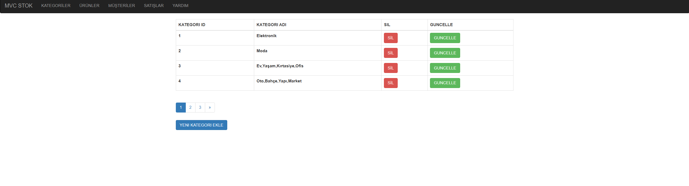
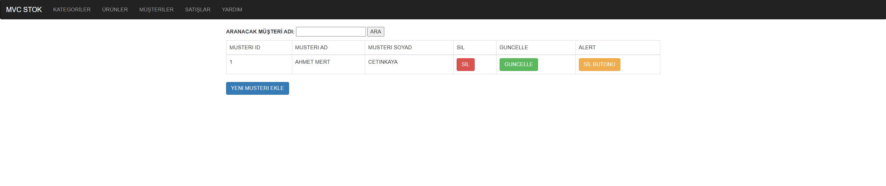
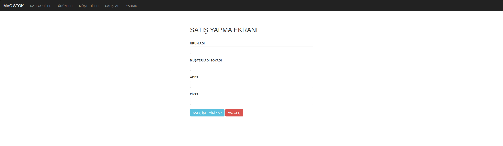

# 🏷️ MVC Stok Yönetim Sistemi

Basit ve işlevsel bir stok yönetim uygulaması. ASP.NET MVC, Entity Framework ve PagedList kullanılarak geliştirilmiştir.  
Kategori, Müşteri, Ürün ve Satış yönetim modülleri ile temel CRUD işlemleri desteklenir.

---

## 🚀 Proje Özeti

- ASP.NET MVC mimarisi kullanıldı  
- Entity Framework ile veritabanı yönetimi  
- Kategori, Müşteri, Ürün ve Satış işlemleri  
- PagedList ile sayfalama (pagination)  
- Basit ve anlaşılır kullanıcı arayüzü

---

## 🛠️ Teknolojiler

| Teknoloji       | Açıklama                  |
|-----------------|---------------------------|
| C#              | Programlama Dili          |
| ASP.NET MVC     | Web Uygulama Framework    |
| Entity Framework| ORM (Veritabanı İşlemleri)|
| SQL Server      | Veritabanı Sistemi        |
| PagedList.Mvc   | Sayfalama Kütüphanesi     |

---

## 📂 Özellikler

### Kategori Yönetimi
- Kategori listeleme (sayfalı)  
- Yeni kategori ekleme  
- Kategori silme  
- Kategori güncelleme  

### Müşteri Yönetimi
- Müşteri listeleme ve ad ile arama  
- Müşteri ekleme  
- Müşteri silme  
- Müşteri güncelleme  

### Ürün Yönetimi
- Ürün listeleme  
- Yeni ürün ekleme (kategori seçerek)  
- Ürün silme  
- Ürün güncelleme (isim, marka, stok, fiyat, kategori)

### Satış Yönetimi
- Satış kaydı oluşturma  
- Satış listeleme (isteğe bağlı geliştirme)  

---

## 📸 Ekran Görüntüleri

  
  
  
<!-- Yeni Satış modülü ekran görüntüsü eklenecekse buraya ekleyin -->

---

## 🖥️ Kurulum & Çalıştırma

1. Projeyi klonlayın veya indirin.  
2. Visual Studio ile açın.  
3. SQL Server’da `MVC_StokEntities` veritabanını oluşturun (varsa script kullanın).  
4. `Web.config` dosyasından connection string’i kendi veritabanı ayarlarınıza göre güncelleyin.  
5. Projeyi derleyip çalıştırın.  
6. Kategori, Müşteri, Ürün ve Satış işlemlerini test edin.

---
## 🙏 Teşekkürler
